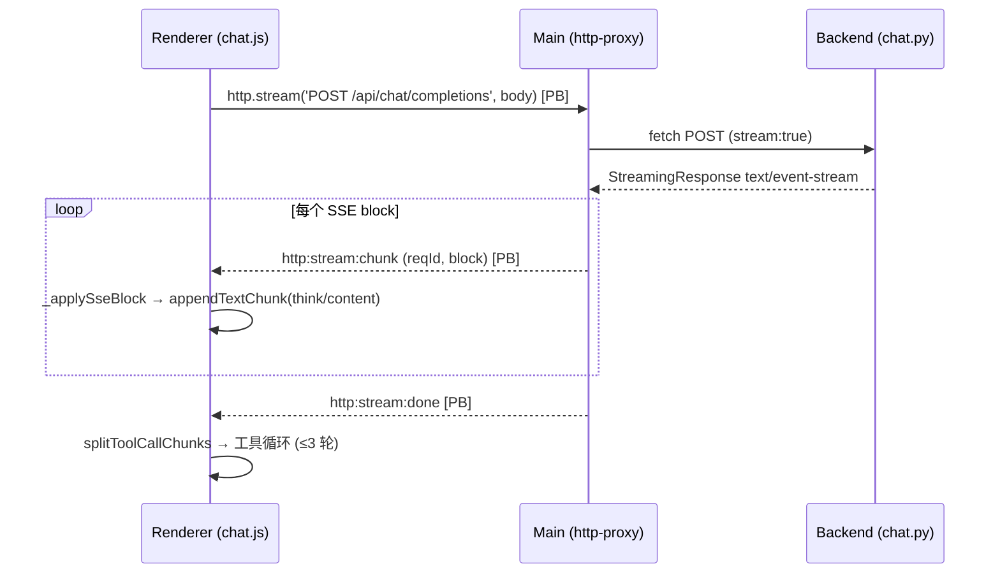
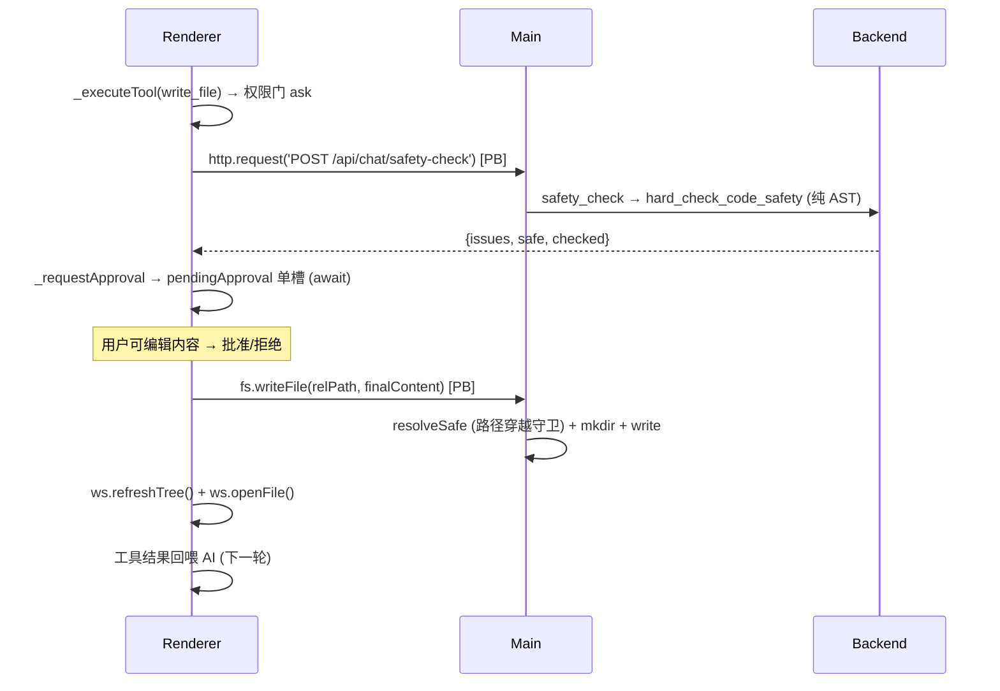
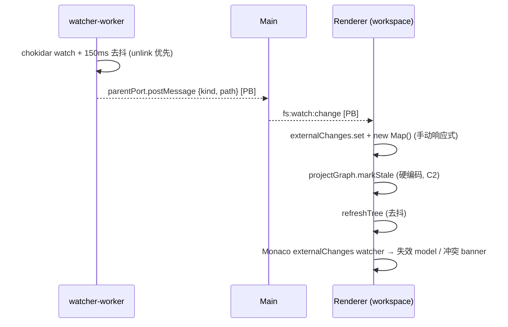

# ARCHITECTURE — KMatch-Desktop 架构总览

> 进程拓扑、数据流、状态更新流。术语对齐 [CONTEXT.md](../CONTEXT.md)。本文件是 CONTEXT 的结构化补充。

## 1. 进程拓扑

四个进程，跨进程边界用 `[PB]` 标注：

```
┌─────────────┐  IPC (structured-clone)  ┌──────────────┐  HTTP/SSE (127.0.0.1:8000)  ┌──────────────┐
│  Renderer   │ ◄──────────────────────► │    Main      │ ◄────────────────────────► │   Backend    │
│  Vue3 沙箱  │   window.api.*            │  Electron/   │                            │  FastAPI     │
│  无 Node    │                           │  Node        │                            │  uvicorn     │
└─────────────┘                           └──────────────┘                            └──────────────┘
       ▲                                         │                                            │
       │ v-show 常驻组件                          │ worker_threads                            │ Bolt
       │                                         ▼                                            ▼
┌─────────────┐                          ┌──────────────┐                            ┌──────────────┐
│ Monaco/视图 │                          │ watcher-     │                            │    Neo4j     │
│ stores      │                          │ worker.cjs   │                            │  4层图谱     │
└─────────────┘                          │ chokidar v4  │                            └──────────────┘
                                         └──────────────┘
```

- **Renderer** — Vue3 + Pinia stores + Monaco + Element Plus。沙箱无 Node，所有系统能力走 `window.api.*`（preload 暴露）。
- **Main** — Electron 主进程。IPC handlers（fs/workspace/http-proxy/window/watcher）+ backend sidecar 生命周期 + watcher worker。
- **Backend** — FastAPI on `:8000`。dev: `python -m uvicorn`；打包: PyInstaller exe（sidecar 自启）。
- **Neo4j** — 4 层图谱 + 原生向量索引，backend-only。

## 2. 数据流（6 条端到端流）

### 2.1 Chat SSE 流



- 后端 `_stream_chat`（`backend/app/api/chat.py:107`）发 `data: {reasoning?, delta?}` + `[DONE]`；错误发 `data: {error}`（200 内）。
- Main `http-proxy.js:42` `http:stream` 拆 `\n\n` 转 block；非 2xx 发 `http:stream:error`（修旧静默丢 body）。
- Renderer `chat.js:558` `_streamResponse` 再缓冲拆 block；`_applySseBlock`（`:539`）解析。
- **注意**：chat 走 `window.api.http.*`，**不走** axios 层（`api/index.js` 仅 graph/diagnostics 用）。F1。

### 2.2 write_file 审批门



- 安全预检失败优雅降级（`chat.js:644,651`），不阻断审批。
- main 侧仅 `resolveSafe` 守卫，无独立写审批（F12）。

### 2.3 委派图谱工具

`generate_project_graph` / `code_review` / `code_test`：`chat.js _delegate` → `window.api.http.request('POST /api/project/{parse,review,test}')` [PB] → 结果卡渲染 + projectGraph 联动。

- generate_project_graph 可离线（`write_to_neo4j:false`）；code_review/code_test 需 Neo4j（503 时 `_delegate` 给提示，`chat.js:707`）。
- 实体点击 → `projectGraph.requestReveal` → Monaco `revealSymbol`（行高亮）；光标移动 → `setActiveLine` → `activeEntityId` 反查。stale 时禁用跳转。

### 2.4 文件监听 → 失效



### 2.5 IPC 全表

见 [CONTEXT.md "进程拓扑"] 与 `electron/preload/index.js`。摘要：

| window.api | channel | 方向 |
|---|---|---|
| `fs.{readFile,stat,listDirectory,writeFile,createFile,deleteFile,rename}` | `fs:*` | R↔M |
| `fs.onChange` | `fs:watch:change` | M→R |
| `workspace.{openProject,setRoot,getRoot,listRecent}` | `workspace:*` | R↔M |
| `http.request` | `http:request` | R↔M（同步返回 {status,body,ok}） |
| `http.{stream,onChunk,onDone,onError}` | `http:stream*` | R→M 起，M→R 流 |
| `window.openDevTools` | `window:openDevTools` | R→M |

序列化：invoke 参数/结果 structured-clone；on* 事件 `(event, reqId, ...args)`，三个 SSE 事件（chunk/done/error）均带 reqId，渲染层按 reqId 过滤并发流（F3）。http-proxy 已按 `\n\n` 分帧，每个 `http:stream:chunk` 是完整 SSE block（无定界符），渲染层直接交 onBlock 不再二次拆分。

### 2.6 后端 agents + 路由

- **LangGraph orchestrator**（`orchestrator.py:105`）：`StateGraph(AgentState)`，`diagnostics → reviewer → graph_controller → content_generator → reviewer(双模) → finish`。场景一闭环。`MemorySaver` checkpointer，`main.py:69` 编译一次。
- **6 子 agent**：diagnostics / reviewer / graph_controller / content_generator / code_reviewer / code_tester。后两个**不走 LangGraph**，由 `/api/project/{review,test}` 直接调。
- **共享**：`code_safety.py`（`hard_check_code_safety`，纯 AST，chat 审批门 + code_reviewer + code_tester 复用）、`llm.py`、`state.py`、`sandbox.py`（`SubprocessSandboxExecutor`，沙箱强化残留）。
- **路由**：`/api/health`,`/api/version` / `/api/diagnostics{assess,assess/stream,submit,feedback}` / `/api/graph/*` / `/api/project/{parse,graph,review,test,examples}` / `/api/learning/report` / `/api/kb/*` / `/api/chat/{completions,models,safety-check}`。

## 3. 状态更新流（8 Pinia stores）

依赖图（无环）：

```
chat ──► workspace, projectGraph, aiSettings (static)
chat ──► assessment (dynamic import)
session ──► assessment (static; activeStage computed)
workspace ──► projectGraph (dynamic; markStale)
assessment, projectGraph, sidebar, aiSettings, theme → 叶
```

### 跨 store 写点（4）

| 写者 → 目标 | 位置 | 内容 |
|---|---|---|
| chat → projectGraph | `chat.js:797` | `setGraph(result, sourcePath)` |
| chat → workspace | `chat.js:758-759` | `refreshTree()` + `openFile()` |
| workspace → projectGraph | `workspace.js:76` | `markStale(path)` |

### 跨 store 读点（6）

| 读者 → 目标 | 位置 | 字段 |
|---|---|---|
| chat → aiSettings | `chat.js:408,719,855` | reasoningMode, permissionFor, memories |
| chat → assessment | `chat.js:849` | profile, hasResults, knowledgeGraph |
| chat → workspace | `chat.js:861` | hasProject, root, activeFile, tree |
| session → assessment | `session.js:25` | hasResults, loading, orchestrationLog, phase |

### 复杂度热点

- **chat.js 1128 行**，混 6 职责（消息模型/SSE/工具/配置/提示词/审批门）—— 主重构目标。
- **`visibleMessages` + `_addMessage` hook + `regenMessage` 冻结** 实现分支可见性，高复杂度核心。
- **Map/Set 响应式手动**：`externalChanges` 每次改要 `new Map(...)`，`dirtyFiles` 无重赋模式（F11）。

## 4. 已知脆弱点

F1–F15 脆弱点清单与"是否纳入重构"决策见 [重构方案_解耦.md](./重构方案_解耦.md)，已全部转为 GitHub Issues。
